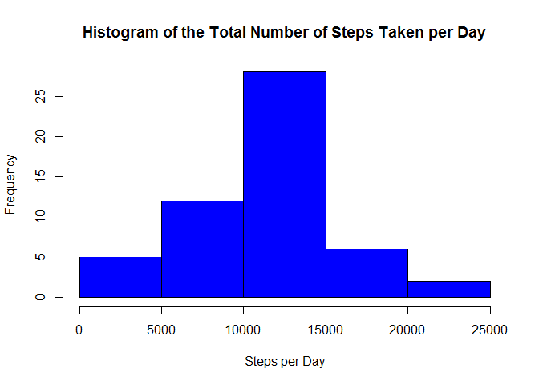
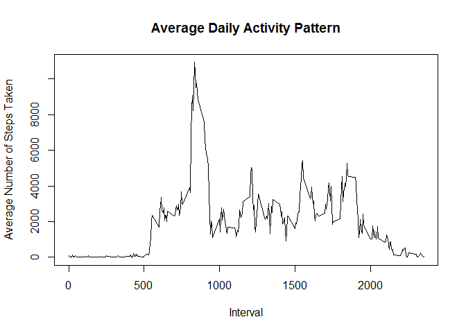
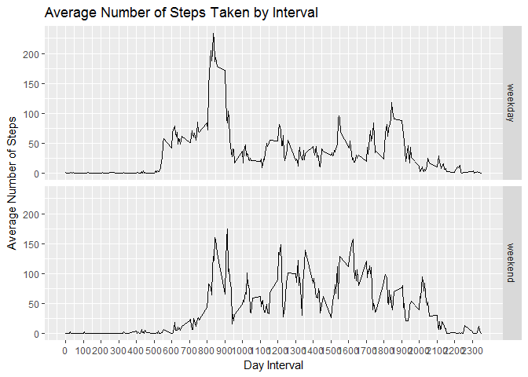

# Reproducible Research: Peer Assessment 1

## 1. Loading and preprocessing the data

```r
library(dplyr)
```

```
## 
## Attaching package: 'dplyr'
```

```
## The following objects are masked from 'package:stats':
## 
##     filter, lag
```

```
## The following objects are masked from 'package:base':
## 
##     intersect, setdiff, setequal, union
```

```r
library(ggplot2)
```


```r
file<-unzip("activity.zip")
data<-read.csv(file, header=TRUE, na.strings="NA")
rm(file)

dataClean<-na.omit(data)
```

## 2. What is mean total number of steps taken per day?

```r
# Sum steps per each day
dataAgg<-aggregate(dataClean$steps, by=list(Date=dataClean$date), FUN=sum)
# Find the mean
mean<-as.integer(mean(dataAgg$x))
# Find the median
median<-as.integer(median(dataAgg$x))

# Simple histogram of steps by day
hist(dataAgg$x, main="Histogram of the Total Number of Steps Taken per Day", xlab="Steps per Day", border="black", col="blue")
```

<!-- -->

Mean total number of steps taken per day is 10766 and the median is 10765.

## 3. What is the average daily activity pattern?

```r
# Sum steps by interval, ignoring missing values (using the dataClean dataset)
dataInt<-aggregate(dataClean$steps, by=list(Interval=dataClean$interval), FUN=sum)

# Plot steps by interval
plot(dataInt$Interval, dataInt$x, type="l", main="Average Daily Activity Pattern", xlab="Interval", ylab="Average Number of Steps Taken" )
```

<!-- -->

```r
# Find the interval with maximum number of steps
maxInt<-dataInt$Interval[which.max(dataInt$x)]
```

On average, across all the days in the dataset, interval 835 contains the maximum number of steps.

## 4. Imputing missing values

```r
# Calculate number of missing values in the original dataset
missingVal<-sum(is.na(data$steps))
```

There are a total of 2304 missing observations in the dataset.


```r
# Create a temporary dataset from raw data and sum steps by interval
dataTemp<-aggregate(data$steps, by=list(Interval=data$interval), FUN=sum)

# Vector of boolean values for missing values in the original dataset
missing <- !complete.cases(data)

# Create a temporary dataset with just the missing values from the original dataset
dataTemp2 <- data[missing == TRUE, ]

# Fill missing values with totals for that interval
dataTemp2[, 1] <- dataTemp$x

# Combine the two sets
imputedData <- rbind(data[complete.cases(data), ], dataTemp2)
# Sum steps by date
imputedData2 <- aggregate(steps ~ date, data = imputedData, sum)
# Simple histogram of steps by day
hist(imputedData2$steps, main="Histogram of the Total Number of Steps Taken per Day", xlab="Steps per Day", border="black", col="blue")
```

<!-- -->

```r
# Calculate the new mean
meanNew<-mean(imputedData2$steps)
meanNew<-as.integer(meanNew)
```

The new mean is 10766

## 5. Are there differences in activity patterns between weekdays and weekends?

```r
# Use the clean imputed dataset for this part
weekDayData<-imputedData

# Make sure the dates are in the proper format
weekDayData$date<-as.Date(weekDayData$date)

# Convert weekdays into proper days
weekDayData$day<-weekdays(weekDayData$date)
# Mark all days as "weekdays" to start
weekDayData$dayType<-"weekday"
# Mark Saturdays and Sundays as "weekend"
weekDayData$dayType[weekDayData$day %in% c("Saturday", "Sunday")] <- "weekend"

# Group intervals into weekdays and weekends and summarize steps for each group
avgPerDay <- weekDayData %>% group_by(interval,dayType) %>% summarise(AvgSteps=mean(steps,na.rm = TRUE))

# Plot the results
ggplot(data=avgPerDay, mapping=aes(x=interval, y=AvgSteps)) + geom_line() + facet_grid(dayType ~ .) + 
    scale_x_continuous("Day Interval", 
    breaks = seq(min(avgPerDay$interval), max(avgPerDay$interval), 100)) + 
    scale_y_continuous("Average Number of Steps") + ggtitle("Average Number of Steps Taken by Interval")
```

<!-- -->
